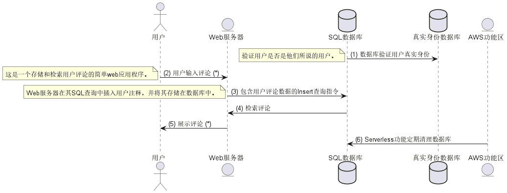
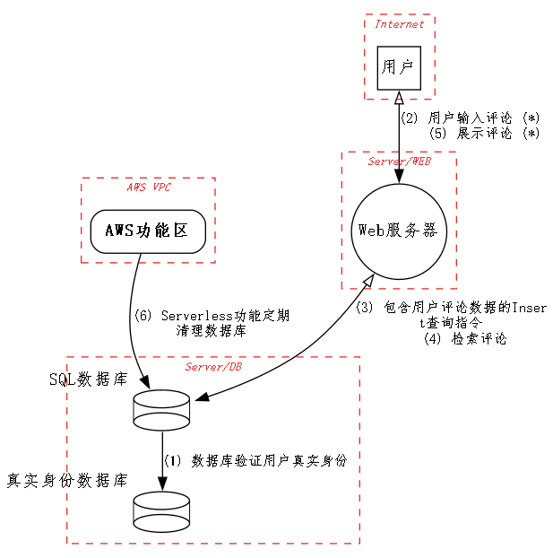
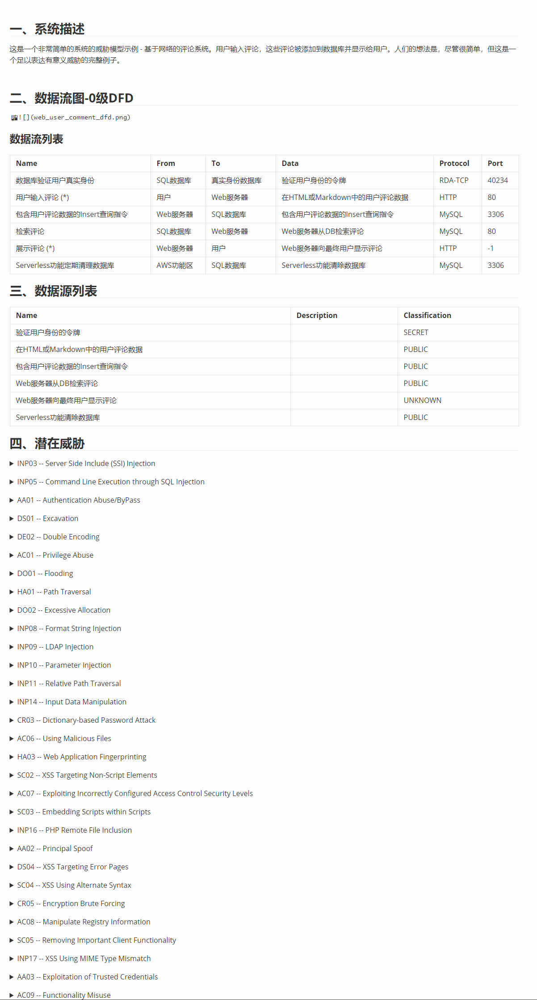

# 代码定义威胁建模 Threat Model By Code 
一款代码定义威胁模型的SDL效能工具


## 一、初衷

在工作中，尤其是迭代需求与设计阶段会参与大量模块的威胁建模工作，传统的或者标准的是情况是使用Microsoft Threat Modeling Tool 或OWASP Threat Dragon.
但，这些工具无法解决的障碍点是:

* 开发在没有安全基础、经验与建模实践的情况下,难以完整的绘制出建模图，或是准确的识别出存在的安全威胁；
* 同样的，对于安全人员而言, 完整准确的识别存在的实体与数据流走向需要非常了解模块的设计

当然，我遇到了pytm项目，它可以同时构建出时序图与建模图；在pytm的基础上，我尝试定义出边界、实体、数据流、存储后，开发设计与安全建模可以实现统一与优雅的存在。

这大大的提升了我的效率与建模的效果，因此在基于原项目的基础上做了部分二次开发，让这款工具更易于使用，在下面我会附上了一个完整的建模案例以供参考。


## 二、二开

thanks to project @pytm

**增强功能列表:**

* **扩展json定义模型，实现几乎0编程完成模型构建**
* 扩展支持windows
* 自带依赖工具
  * https://github.com/plantuml/plantuml/releases/tag/v1.2022.14
  * https://graphviz.gitlab.io/download/ （不要删减内容，会报错~）
* 扩展支持一次性生成
* 扩展中文支持， 修改_dfd_template下fontnam，从Arial到FangSong
* 扩展seq size

TODO:
* 生成静态图
* 补充通信数据流类型 (RPC,IPC,PIPE等本地通信等)
* 补充威胁经验项


## 三、使用案例 - 需求名称: WEB站点上用户评论功能

### 1. 生成代码文件

#### 1.1 JSON定义模型(推荐)

只需定义出类似如下的json数据结构即可描述需求设计涉及的实体，边界与数据流：

```json
this_ = {
    "base":{
        "title":"WEB站点上用户评论功能",
        "desc": "这是一个非常简单的系统的威胁模型示例 - 基于网络的评论系统。用户输入评论，这些评论被添加到数据库并显示给用户。人们的想法是，尽管很简单，但这是一个足以表达有意义威胁的完整例子。"
    },
    "boundarys": {
        "b_Internet":{

        },
        "b_Server/DB":{

        },
        "b_Server/WEB":{

        },
        "b_AWS VPC":{

        }
    },
    "elements":{
        "e_用户":{
            "roler": "Actor",
            "in": "b_Internet"
        },
        "e_Web服务器":{
            "roler": "Server",
            "in": "b_Server/WEB"
        },
        "e_SQL数据库":{
            "roler": "Datastore",
            "in": "b_Server/DB"
        },
        "e_真实身份数据库":{
            "roler": "Datastore",
            "in": "b_Server/DB"
        },
        "e_AWS功能区":{
            "roler": "Lambda",
            "in": "b_AWS VPC"
        }
    },
    "dataflows": {
        "1": {
            "flowto": ["e_SQL数据库","e_真实身份数据库","f_数据库验证用户真实身份"],
            "flowdesc": {
                "protocol": "RDA-TCP",
                "dstPort": 40234,
                "data": [
                    "d_验证用户身份的令牌", 
                    "SECRET"
                ],
                "note": """验证用户是否是他们所说的用户。""",
                "maxClassification": "SECRET"
            }
        },
        "2": {
            "flowto": ["e_用户","e_Web服务器","f_用户输入评论 (*)"],
            "flowdesc": {
                "protocol": "HTTP",
                "dstPort": 80,
                "data": [
                    "d_在HTML或Markdown中的用户评论数据", 
                    "PUBLIC"
                ],
                "note": """这是一个存储和检索用户评论的简单web应用程序。""",
                "maxClassification": "PUBLIC"
            }
        },
        "3": {
            "flowto": ["e_Web服务器","e_SQL数据库","f_包含用户评论数据的Insert查询指令"],
            "flowdesc": {
                "protocol": "MySQL",
                "dstPort": 3306,
                "data": [
                    "d_包含用户评论数据的Insert查询指令", 
                    "PUBLIC"
                ],
                "note": """Web服务器在其SQL查询中插入用户注释，并将其存储在数据库中。""",
                "maxClassification": "PUBLIC"
            }
        },
        "4": {
            "flowto": ["e_SQL数据库","e_Web服务器","f_检索评论"],
            "flowdesc": {
                "protocol": "MySQL",
                "dstPort": 80,
                "data": [
                    "d_Web服务器从DB检索评论", 
                    "PUBLIC"
                ],
                "note": """这是一个存储和检索用户评论的简单web应用程序。""",
                "maxClassification": "PUBLIC"
            }
        },
        "5": {
            "flowto": ["e_Web服务器","e_用户","f_展示评论 (*)"],
            "flowdesc": {
                "protocol": "HTTP",
                "dstPort": -1,
                "data": [
                    "d_Web服务器向最终用户显示评论", 
                    "PUBLIC"
                ],
                "note": """""",
                "maxClassification": "PUBLIC"
            }
        },
        "6": {
            "flowto": ["e_AWS功能区","e_SQL数据库","f_Serverless功能定期清理数据库"],
            "flowdesc": {
                "protocol": "MySQL",
                "dstPort": 3306,
                "data": [
                    "d_Serverless功能清除数据库", 
                    "PUBLIC"
                ],
                "note": """""",
                "maxClassification": "PUBLIC"
            }
        },

    }
}
```

详情参考example/json/web_user_comment_json.py

#### 1.2. 编程定义模型(可选)

1. 定义全景
```python
tm = TM("WEB站点上用户评论功能")
tm.description = "这是一个非常简单的系统的威胁模型示例 - 基于网络的评论系统。用户输入评论，这些评论被添加到数据库并显示给用户。人们的想法是，尽管很简单，但这是一个足以表达有意义威胁的完整例子。"
tm.isOrdered = True # 自动排序所有数据流 
tm.mergeResponses = True # UI配置: 合并DFD中的edge边缘
tm.assumptions = [ # 假设列表
"", # 补充一些假设条件,包括使用场景，异常情况等
]
```

2. 定义信任边界
```python
internet = Boundary("Internet")
server_db = Boundary("Server/DB")
server_db.levels = [2]
server_web = Boundary("Server/WEB")
server_web.levels = [2]
vpc = Boundary("AWS VPC")
```

3. 定义实体
```python
## 操作者实体
user = Actor("用户")
user.inBoundary = internet # 实体归属到网络信任边界内
user.levels = [2]
## 服务器实体
web = Server("Web服务器")
web.inBoundary = server_web # 实体归属到server_web信任边界内
web.levels = [2]
web.OS = "Ubuntu" # 配置信息
web.controls.isHardened = True
web.controls.sanitizesInput = False
web.controls.encodesOutput = True
web.controls.authorizesSource = False
web.sourceFiles = ["pytm/json.py", "docs/template.md"]
## 数据库实体
db = Datastore("SQL数据库")
db.OS = "CentOS"
db.controls.isHardened = False
db.inBoundary = server_db
db.type = DatastoreType.SQL
db.inScope = True
db.maxClassification = Classification.RESTRICTED
db.levels = [2]
## 数据库实体-2
secretDb = Datastore("真实身份数据库")
secretDb.OS = "CentOS"
secretDb.sourceFiles = ["pytm/pytm.py"]
secretDb.controls.isHardened = True
secretDb.inBoundary = server_db
secretDb.type = DatastoreType.SQL
secretDb.inScope = True
secretDb.storesPII = True
secretDb.maxClassification = Classification.TOP_SECRET
## 功能区实体
my_lambda = Lambda("AWS功能区")
my_lambda.controls.hasAccessControl = True
my_lambda.inBoundary = vpc
my_lambda.levels = [1, 2]
```

4. 定义数据与流
```python
## 用户凭证数据
token_user_identity = Data(
    "验证用户身份的令牌", classification=Classification.SECRET  # 数据类级: 机密
)
## 流
db_to_secretDb = Dataflow(db, secretDb, "数据库验证用户真实身份")
db_to_secretDb.protocol = "RDA-TCP"
db_to_secretDb.dstPort = 40234
db_to_secretDb.data = token_user_identity
db_to_secretDb.note = "验证用户是否是他们所说的用户。"
db_to_secretDb.maxClassification = Classification.SECRET
## 用户评论数据
comments_in_text = Data(
    "在HTML或Markdown中的用户评论数据", classification=Classification.PUBLIC
)
## 流
user_to_web = Dataflow(user, web, "用户输入评论 (*)")
user_to_web.protocol = "HTTP"
user_to_web.dstPort = 80
user_to_web.data = comments_in_text
user_to_web.note = "这是一个存储和检索用户评论的简单web应用程序。"
## 数据库指令操作数据
query_insert = Data("包含用户评论数据的Insert查询指令", classification=Classification.PUBLIC)
## 流
web_to_db = Dataflow(web, db, "包含用户评论数据的Insert查询指令")
web_to_db.protocol = "MySQL"
web_to_db.dstPort = 3306
web_to_db.data = query_insert
web_to_db.note = (
    "Web服务器在其SQL查询中插入用户注释，并将其存储在数据库中。"
)
## 数据库返回的评论数据
comment_retrieved = Data(
    "Web服务器从DB检索评论", classification=Classification.PUBLIC
)
## 流
db_to_web = Dataflow(db, web, "检索评论")
db_to_web.protocol = "MySQL"
db_to_web.dstPort = 80
db_to_web.data = comment_retrieved
db_to_web.responseTo = web_to_db
## web服务器返回给用户的数据
comment_to_show = Data(
    "Web服务器向最终用户显示评论", classifcation=Classification.PUBLIC
)
## 流
web_to_user = Dataflow(web, user, "展示评论 (*)")
web_to_user.protocol = "HTTP"
web_to_user.data = comment_to_show
web_to_user.responseTo = user_to_web
## web服务器返回给用户的数据
clear_op = Data("Serverless功能清除数据库", classification=Classification.PUBLIC)
## 流
my_lambda_to_db = Dataflow(my_lambda, db, "Serverless功能定期清理数据库")
my_lambda_to_db.protocol = "MySQL"
my_lambda_to_db.dstPort = 3306
my_lambda_to_db.data = clear_op
```

详情参考example/raw/web_user_comment.py

### 2. 生成结果

  * 时序图

    ```
    # json定义模型参考命令 --后面依次类推不再展开
    cd example/json
    py -3 new_web_user_comment_json_model.py --seq
    
    # 代码定义模型参考命令
    cd example/raw
    py -3 web_user_comment.py --seq # cache目录下的tmp_seq.png即为时序图
    ```

    

  * 威胁建模图

    ```
    py -3 web_user_comment.py --dfd # cache目录下的tmp_dfd.png即为建模图
    ```

    

  * 报告

    ```
    py -3 web_user_comment.py --report ../docs/basic_template_cn.md # cache目录下的tmp_report.md即为报告
    ```

    

### 3. 建模的后利用

* 补充威胁项

​		项目中自带的为通用常见的威胁，基于STRIDE,CIA等技巧或者基于实际的业务常见再对威胁进行拓展识别与补充

* 组织评审会议

  * 确认威胁等级

  * 确认威胁存在情况与消减措施

* 代码审计确认威胁消减


